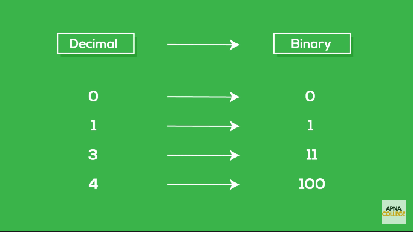
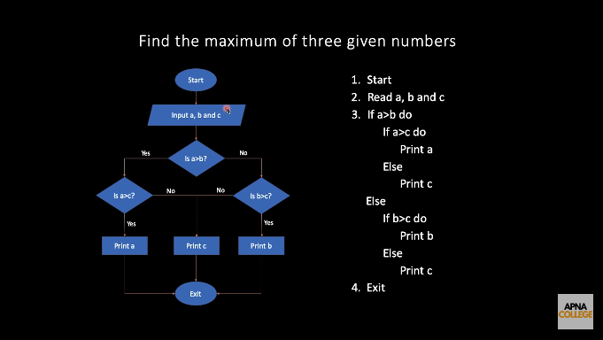
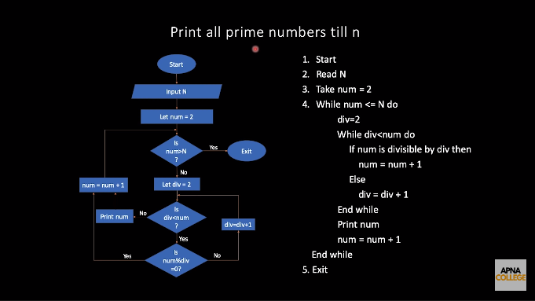

**C++ (sometimes abbreviated as CPP)** is a **high-level general-purpose object-oriented programming language** created by Danish computer scientist **Bjarne Stroustrup**.

# Learning Objectives:

- Introduction to C++ Programming
- Necessary Installations 
- Good VS Code Settings
- Writing our first C++ program.
- Flowchart & Pseudocode
---

# Introduction to C++ Programming





---
# Necessary Installations

1. **Visual Studio Code IDE** : Download and Install it from the official site. Made and distributed by Microsoft. It's free and open-source.

1. **MinGW-x64 GCC G++ Compiler (MSYS2)** : 
    - Go to the site (https://code.visualstudio.com/docs/languages/cpp). 
    - Under the heading ***Example: Install MinGW-x64***, find the link to MSYS2 Installer. 
    - Clicking on the link should download the ***msys2-x86_64-20220603.exe*** file immediately. 
    - Run the installer. 
    - Enter your desired Installation Folder.
    - When done, click Finish.
    - Now MSYS2 is ready for you and a terminal for the MINGW64 environment will launch.
    - You will probably want to install some tools like the mingw-w64 GCC to start compiling:

    ```
    $ pacman -S mingw-w64-x86_64-gcc
    resolving dependencies...
    looking for conflicting packages...

    Packages (15) mingw-w64-x86_64-binutils-2.39-2
                mingw-w64-x86_64-crt-git-10.0.0.r68.g6eb571448-1
                mingw-w64-x86_64-gcc-libs-12.2.0-1  mingw-w64-x86_64-gmp-6.2.1-3
                mingw-w64-x86_64-headers-git-10.0.0.r68.g6eb571448-1
                mingw-w64-x86_64-isl-0.25-1  mingw-w64-x86_64-libiconv-1.17-1
                mingw-w64-x86_64-libwinpthread-git-10.0.0.r68.g6eb571448-1
                mingw-w64-x86_64-mpc-1.2.1-1  mingw-w64-x86_64-mpfr-4.1.0.p13-1
                mingw-w64-x86_64-windows-default-manifest-6.4-4
                mingw-w64-x86_64-winpthreads-git-10.0.0.r68.g6eb571448-1
                mingw-w64-x86_64-zlib-1.2.12-1  mingw-w64-x86_64-zstd-1.5.2-2
                mingw-w64-x86_64-gcc-12.2.0-1

    Total Installed Size:  397.59 MiB

    :: Proceed with installation? [Y/n]
    [... downloading and installation continues ...]
    ```

    - Add the path to your Mingw-w64 bin folder to the Windows PATH environment variable by using the following steps:

        - In the Windows search bar, type 'env'. 
        - Select "Edit the System Environment Variables".
        - Click on the 'Environment Variables' button.
        - Under 'User Variables for Account' - Choose the Path variable then select Edit.
        - Select New and add the Mingw-w64 destination folder path, with \mingw64\bin appended, to the system path. The exact path depends on which version of Mingw-w64 you have installed and where you installed it. If you used the settings above to install Mingw-w64, then add this to the path: C:\msys64\mingw64\bin.
        - Select OK to save the updated PATH. You will need to reopen any console windows for the new PATH location to be available.


    - To check that your Mingw-w64 tools are correctly installed and available, open a new Command Prompt and type:
        
        ```
        gcc --version
        g++ --version
        ```
        If you don't see the expected output or g++ or gcc is not a recognized command, make sure your PATH entry matches the Mingw-w64 binary location where the compiler tools are located.

1. **Important VS Code Extensions** :
    - C/C++ (by Microsoft)
    - Code Runner (by Jun Huan)
---

# Good VS Code Settings

- In the VS Code, Gear Icon --> go to Settings. Search for 'mouse wheel' in the search bar. Check the "Mouse Wheel Zoom" option.
- In the VS Code, Gear Icon --> go to Settings. Search for 'code runner'. Check "Clear Previous Output". Check "Run in Terminal" (optional).

- In the VS Code, Gear Icon --> go to Keyboard Shortcuts --> Here you can edit the keyboard shortcuts for VS Code. Example - Search for 'copy line down' shorcut.
---

# Writing our first C++ program

Create a new file named **play.cpp** and add the following code to it.

**play.cpp**:
```cpp
 #include<iostream>

 // using namespace std;

 int main() {
    // cout << "Hello World";
    std::cout<<"Hello World";
    return 0;
 }
```
**To execute the file:**
- open a VS Code Terminal (Keyboard Shortcut : ***ctrl + `*** ).
- type "g++ play" and press Tab to autocomplete. ENTER. This creates an "a.exe" file.
- In terminal, type a --> TAB (autocomplete) --> ENTER.
- The file executes.

                                    ***OR***

- Just press the "Run Code Button" on the *Top-Right-Corner* (Looks like a Video Play Button). This will do all the steps and will directly show the output in the terminal. This step also produces a playground.exe file.

**Output:** Hello World

---

# Flowchart & Pseudocode




