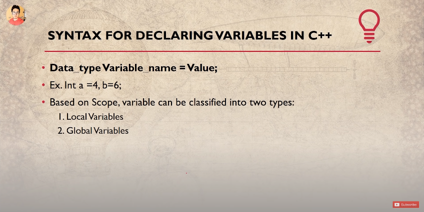
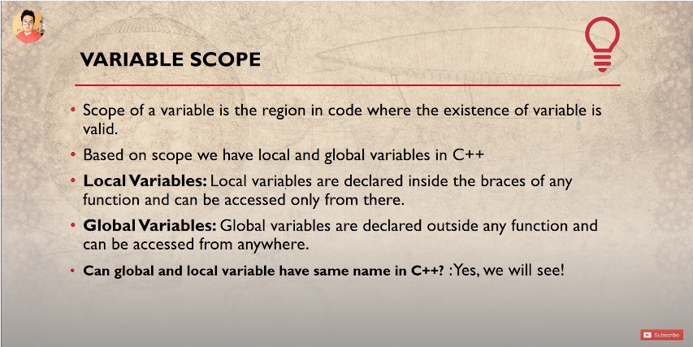
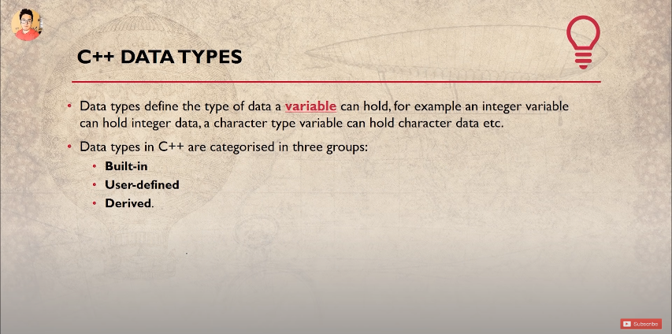
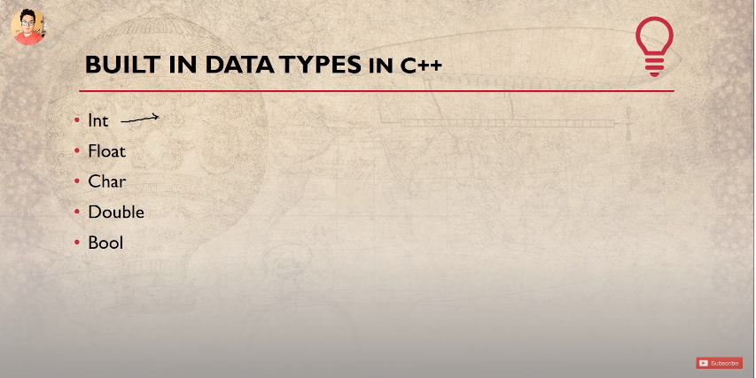
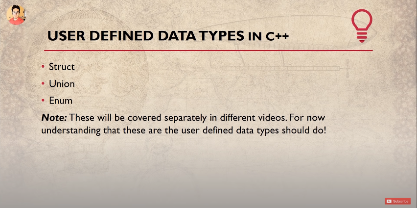
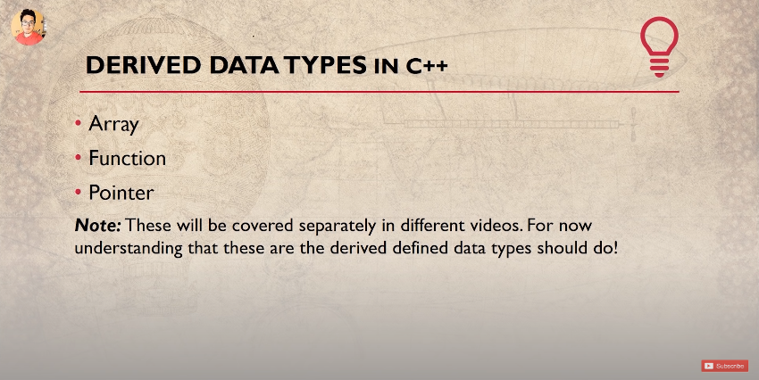
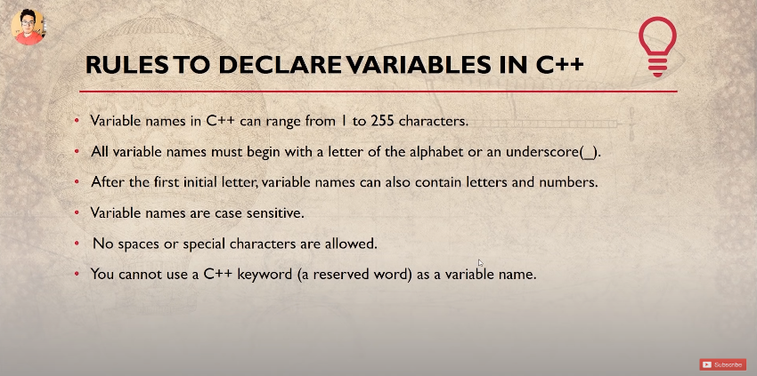

# Code For Demostrating Local And Global Variables

```cpp
#include <iostream>

using namespace std;

// A variable that is not declared inside any function is called a Global Scope Variable.
// This variable is valid/recognised throughout the entire program and can be used within any function.
int glo = 50;

void sum (){
    // void means that the fuction is not going to return anything but void.
    // A variable that is declared within a function is called Local Scope Variable and is valid/recognised within the function only. Example Below.
    int glo = 45;

    cout<<"I am glo within sum() " << glo << ".";
}
int main()
{
    sum(); // 45

    // The point to be learnt here is that local variable always takes precedence over global variable.
    
    cout << "\nI am glo within main() " << glo << ".\n"; // 50

    return 0;
}
```

