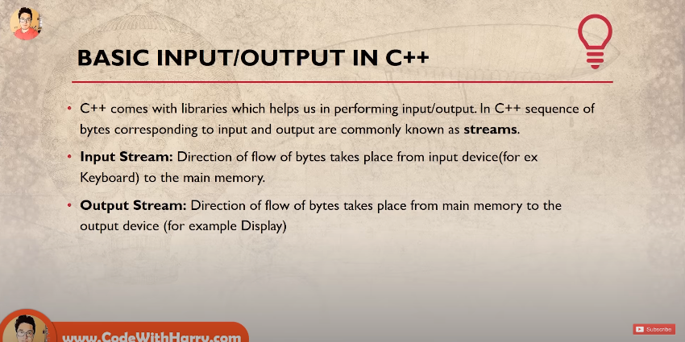
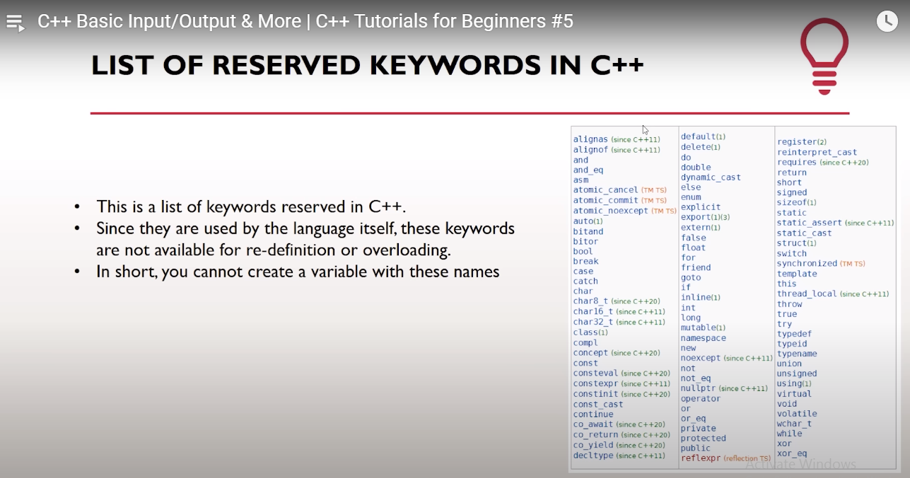
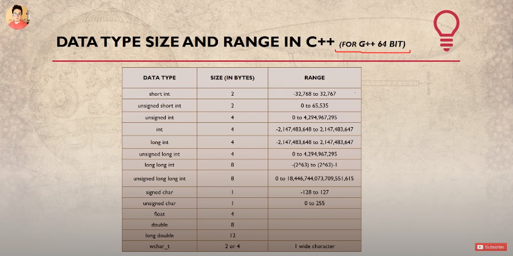

# A Simple Program To Take 2 User Inputs (Numbers) And Print Their Sum.

```cpp
#include <iostream>
using namespace std;

int main () {

    int num1, num2;

    cout << "Enter num1 :\n";
    cin >> num1;

    cout << "Enter num2 :\n";
    cin >> num2;

    cout << "Sum of num1 & num2 = " << num1 + num2 << ".\n";

    return 0;
}

// << is called the Insertion Operator (Inserts data into an output stream, such as cout.).
// >> is called the Extraction Operator (Extracts data from an input stream, such as cin.).
```





