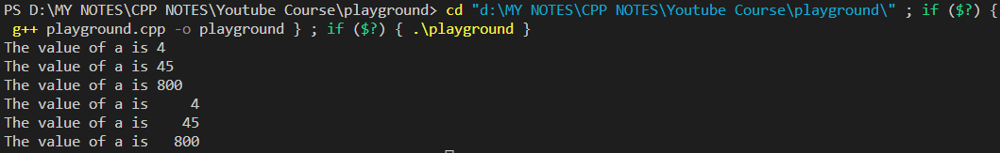

# CONSTANTS IN C++

```cpp
#include <iostream>

using namespace std;

int main() {

    // *********************** CONSTANTS IN C++ *************************************

    const int a = 40;
    // Using 'const' keyword before any Variable Declaration makes the Variable CONSTANT.
    // i.e, we cannot change the value of a constant variable later on in the program.
    // If we try to change its value ===> Program will give us an Error.
    // In this case, we cannot change the value of 'const int a = 40'.

    
    return 0;
}
```

# Manipulators in C++


**Manipulators** are operators that are used to format the data display.

The two manipulators that we need to know about are

1.  endl --- We already know its use.
1.  setw(num) ---- Comes from `<iomanip>` Header File.

Study the code below to see the use of **setw(num)** manipulator.

```cpp
#include <iostream>
#include <iomanip>

using namespace std;

int main() {

    int a = 4, b = 45, c = 800;

    // Without using setw
    cout << "The value of a is " << a << endl;
    cout << "The value of a is " << b << endl;
    cout << "The value of a is " << c << endl;

    // *************** Using setw(num) Function from <iomanip> Header File ****************
    // setw(num) function basically makes our output Right Justified.
    // Bigger the value of num is --- more the output is going to shift rightwards.
    // See the Output to see the difference in Outputs before and after using setw.
    cout << "The value of a is " << setw(5) << a << endl;
    cout << "The value of a is " << setw(5) << b << endl;
    cout << "The value of a is " << setw(5) << c << endl;

    return 0;
}
```

**Output :**

