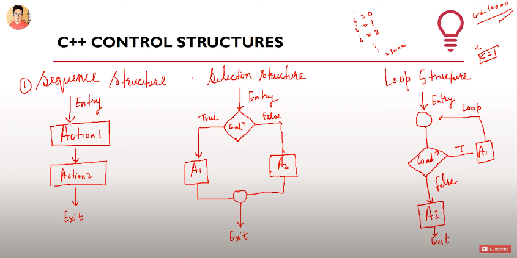

In C++, there are 3 types of Control Structures:

1. Sequence Structure
1. Selection Structure
1. Loop Structure




# Selection Control Structure: if-else if-else Ladder

```cpp
#include <iostream>

using namespace std;

int main() {

    int age;

    cout << "Tell Me Your Age?" << endl;
    cin >> age;

    if (age < 0) {
        cout << "You Are Not Yet Born Mate!" << endl;
    }
    else if (age < 18 && age > 0) {
        cout << "You are not old enough to join the party!" << endl;
    }
    else if (age == 18) {
        cout << "Grow a bit more kid." << endl; 
    }
    else {
        cout << "Welcome To The Party Mate!" << endl;
    }

    return 0;
}
```

# Selection Control Structure: Switch-Case Statement

## Basic Syntax:

```cpp
    //switch -- emmet
    switch (expression)
    {
    case /* constant-expression */:
        /* code */
        break;
    
    default:
        break;
    }
```

## Example Program:

```cpp
#include <iostream>

using namespace std;

int main() {

    int age;

    cout << "Tell Me Your Age Buddy !" << endl;
    cin >> age;

    //switch -- emmet
    switch (age)
    {
    case 18:
        cout << "You are 18." << endl;
        break;
    
    case 21:
        cout << "You are 21." << endl;
        break;
    
    case 50:
        cout << "You are 50." << endl;
        break;
    
    case 60:
        cout << "You are 60." << endl;
        break;
    
    default:
        cout << "No special case." << endl;
        break;
    }

    return 0;
}
```