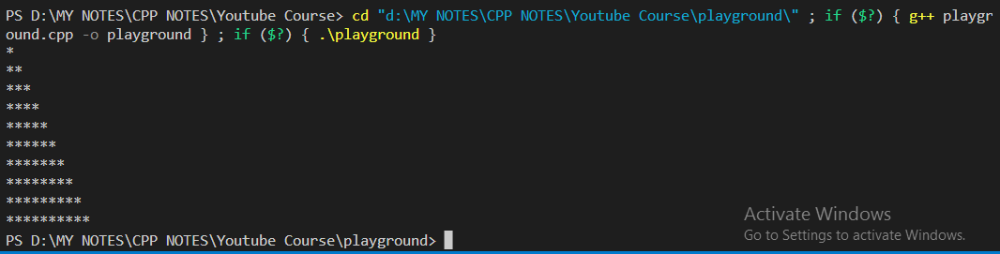

# For Loop in C++

### Example -1:
---

```cpp
#include <iostream>

using namespace std;

int main() {

    int sum = 0;

    /*
                            Syntax of for - Loop;
         **********************************************************

         for (initialization ; condition ; updation) {
              loop body (C++ Code);    
         }
    */
   
    // If the condition = true ------> For Loop Restarts.
    // If the condition = false -----> For Loop Exits.

    for (int i = 0; i<=1000; i++) {
        sum += i;
    }

    cout << sum << endl;
    
    return 0;
}      
```

### Output - 1:
----


### Example - 2:
---

```cpp
#include <iostream>

using namespace std;

int main()
{

    for (int i = 1; i <= 10; i++)
    {
        for (int j=1; j<=i ; j++) {
            cout << "*";
        }
        cout << endl;
    }

    return 0;
}
```

### Output - 2:
---


### Example - 3: Infinite Loop
----

```cpp
#include <iostream>

using namespace std;

int main() {
    
    for (int i = 1; (34 < 40); i++) {
        // In this case, the condition (34 < 40) is always true.
        // So, the loop will never exit and will be infinite.
        cout << "*" << endl ;
    }
    return 0;
}
```

# While Loop in C++:

```cpp
// Program using while loop to print numbers from 1 to 40.

#include <iostream>

using namespace std;

int main() {
    int i = 1;
    while (i <= 40) {
        cout << i << " ";
        i++;
    }
    return 0;
}
```

### Example of Infinite While Loop:

```cpp
#include <iostream>

using namespace std;

int main() {
    int i = 1;
    while (true) {
        cout << i << " ";
        i++;
    }
    return 0;
}
```

# do-while Loop in C++:

```cpp
// Printing all numbers from 1 to 40.

#include <iostream>

using namespace std;

int main() {
    int i = 1;
    do {
        cout << i << endl;
        i++;
    }
    while (i <= 40);

    return 0;
}
```