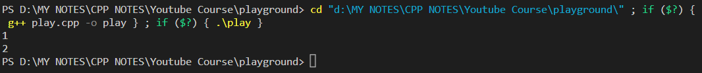
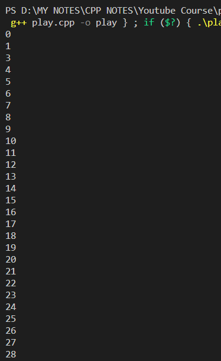
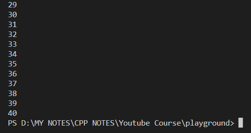

# Use of break Statement:

### **Code**:
---

```cpp
#include <iostream>

using namespace std;

int main () {
    for (int i = 1; i <= 40; i++) {
        cout << i << endl;
        if (i==2) {
            break;
            // When i = 2, break out of the complete for loop. 
        }
    }
    return 0;
}
```

### **Output**:
---



# Use of continue Statement:

### **Code**:
---

```cpp
#include <iostream>

using namespace std;

int main () {
    for (int i = 0; i <= 40; i++) {
        if (i==2) {
            continue;
            // If i = 2, skip the below lines of code and and continue from next loop iteration.
        }
        cout << i << endl;
        // This line of code will not be executed for iteration i = 2.
    }
    return 0;
}
```

### **Output**: *(You can see that i=2 is missing in the output.)*
---


