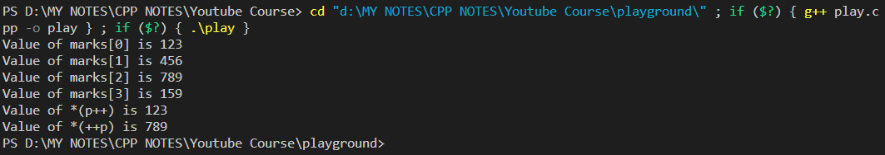

### Code:
----

```cpp
#include <iostream>
using namespace std;

int main () {
    // Declaring an Array 'marks' to hold 4 Integers.
    //************************************************
    
    // Way 1:
    //--------
    // int marks[4] = { 45 , 84 , 96 , 72 };

    //Way 2:
    //--------
    int marks[] = { 2245 , 5684 , 8596 , 1272 };

    cout << "Values of marks Array:" << endl; 
    cout << marks[0] << endl;
    cout << marks[1] << endl;
    cout << marks[2] << endl;
    //You can also change the value of an Array before it gets printed/used somewhere.
    marks[3] = 6000;
    cout << "Original value of marks[3] = 1272 | New Value = "<< marks[3] << endl;

    // Way 3:
    //---------
    int age[4];
    age[0] = 45;
    age[1] = 16;
    age[2] = 50;
    age[3] = 96;

    cout << "Values of age Array:" << endl; 
    cout << age[0] << endl;
    cout << age[1] << endl;
    cout << age[2] << endl;
    cout << age[3] << endl;

    return 0;
}
```

### Output:
---


### Code:
----

```cpp
// Using a for Loop to print the values of an Array.
// We can also do this using while and do-while loops.

#include <iostream>
using namespace std;

int main () {
    int marks[] = {123, 456, 789, 159};
    for (int i = 0; i < 4 ; i++) {
        cout << "Mark in array position " << i << " is " << marks[i] << endl;
    }
    return 0;
}
```

### Output:
---


# Pointers And Arrays:

### Code :
---

```cpp
// Using Pointers for Arrays.

#include <iostream>
using namespace std;

int main () {
    // Declaring an Array called marks.
    int marks[] = {123, 456, 789, 159};

    // Making a pointer variable for the just declared array.
    int* p = marks;
    // Note: For Arrays, you dont have to write as '&marks'. Because, in C++, the arrays theselves work as pointers who store the addresses of the variables that are listed within the array.

    cout << "Value of marks[0] is " << *p << endl;      // First Element.
    cout << "Value of marks[1] is " << *(p+1) << endl;  // Second Element.
    cout << "Value of marks[2] is " << *(p+2) << endl;  // Third Element.
    cout << "Value of marks[3] is " << *(p+3) << endl;  // Fourth Element.
  
    cout << "Value of *(p++) is " << *(p++) << endl;    // First Element. //print *p then increment the pointer to *(p+1)
    cout << "Value of *(++p) is " << *(++p) << endl;    // Third Element.  //increment the pointer from *(p+1) to *(p+2) then print *(p+2)

    return 0;
}
```

### Output:
---
