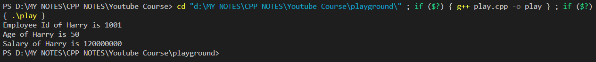
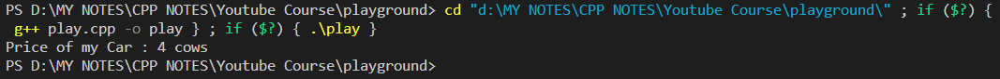
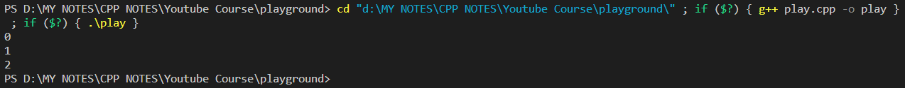
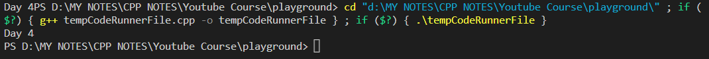
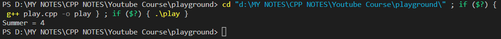

# Structures In C++:

### Code:
---
```cpp
#include <iostream>
using namespace std;

// Creating a Struct.
// emmet --- struct
typedef struct employee {
    int empId;
    int age;
    int salary;
} ep;

// `struct` keyword allows us to create a user defined datatype (in this case employee) and a template of propeties for creating the datatype variables each of which will have its own set of property values.

// We can give a short name (ep) to our entire struct block even without using the `typedef` keyword.  

int main () {
    // Creating instances of the Struct.
    struct employee harry;

    // We can also create instances of a Struct like this (below).
    // For this we need to write 'typedef' infront of 'struct' keyword (Line 6)
    // and give a short name for calling the struct (in this case 'ep') at the end of the 
    // struct declaration block (Line 10.)
    ep pritam;
    ep rohit;

    // Setting Attribute Values for Struct harry.
    harry.empId = 1001;
    harry.age = 50;
    harry.salary = 120000000;

    cout << "Employee Id of Harry is " << harry.empId << endl;
    cout << "Age of Harry is " << harry.age << endl;
    cout << "Salary of Harry is " << harry.salary << endl;

    return 0;
}
```

### Output:
---




# Unions in C++:

### Code:
---

```cpp
#include <iostream>
using namespace std;

// In ancient times, Barter System was the method of transactions for purchasing something.
// Lets say, we went to buy something. Now we can either pay the shopkeeper in rice (kgs) or money (pounds) or cows(no.of cows).
// Union kind of works based on the same logic.

// Creating a Union.
union money {
    int rice;
    float pounds;
    int cows;
};

int main () {
    // Union is similar to structure.
    // But in a Union, you can assign value - to only one of the attributes - inside the function.
    // So, in this case, we can assign value to only either rice or pounds or cows attribute inside the int main() function. 
    
    // Creating an instance of the union.
    union money forCar;

    forCar.cows = 4;
    // We are paying 4 cows for buying our car.
    // Now as per union concept, you can no further assign values for forCar.pounds or     forCar.rice inside this function.

    cout << "Price of my Car : " << forCar.cows << " cows" << endl;

    return 0;
}
```

### Output:
---



# Enum (Enumeration) in C++:

### Code - 1:
---

```cpp
#include <iostream>
using namespace std;

int main () {
    // Demostration of using enum.
    enum Meal {breakfast, lunch, dinner};

    cout << breakfast << endl ; // 0
    cout << lunch << endl ;     // 1
    cout << dinner << endl ;    // 2

    // Here, enum keyword,
    // 1. creates a dataType 'Meal'
    // 2. assigns each of the 'Meal {breakfast, lunch, dinner}' a number starting from 0 by default.
    return 0;
}
```

### Output -1:
---


### Code -2:
----

```cpp
#include <iostream>
using namespace std;

enum week { Sunday, Monday, Tuesday, Wednesday, Thursday, Friday, Saturday };

int main()
{
    week today;
    today = Wednesday;
    cout << "Day " << today+1 << endl;
    return 0;
}
```

### Output-2:
----




### Code 3 - Changing Default Value of Enums
---

```cpp
#include <iostream>
using namespace std;

enum seasons { spring = 34, summer = 4, autumn = 9, winter = 32};

int main() {

    seasons s;

    s = summer;
    cout << "Summer = " << s << endl;

    return 0;
}
```

### Output -3:
---

