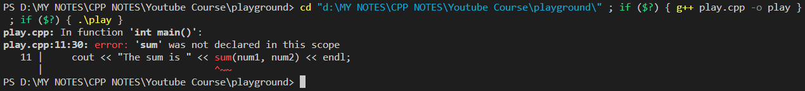

# Making A Simple Function:

```cpp
#include <iostream>
using namespace std;

// Making a simple function to add 2 numbers.
int sum(int a, int b) {
    int c = a + b;
    return c;
}

int main() {

    int num1, num2;
    cout << "Enter your first number:" << endl;
    cin >> num1;
    cout << "Enter your second number:" << endl;
    cin >> num2;
    cout << "The sum is " << sum(num1, num2) << endl; // Calling the function.

    return 0;
}
```

# Function Prototyping:

Consider the below code:

```cpp
#include <iostream>
using namespace std;

int main() {

    int num1, num2;
    cout << "Enter your first number:" << endl;
    cin >> num1;
    cout << "Enter your second number:" << endl;
    cin >> num2;
    cout << "The sum is " << sum(num1, num2) << endl;

    return 0;
}

int sum(int a, int b) {
    int c = a + b;
    return c;
}
```

If you run the above code, you are gonna get the following output:



This error occurs because, the int main() function is executed before the int sum() function in the serial progressive execution of the program above. 

In order, to remove this error, we can use Function Prototyping.
See the code below.

```cpp
#include <iostream>
using namespace std;

// Function Prototyping
//************************
// We are instructing our program to lookout for a function 'int sum(int a, int b)' which will be used/called in the 'int main()' function but is defined somewhere in the later stages of the program (after 'int main()').
int sum(int a, int b);

// Another way of function protyping:
// int sum (int, int);

// Wrong way:
// int sum (int a, b);

// Another Example of Function Prototyping
void greet();

int main() {

    int num1, num2;
    cout << "Enter your first number:" << endl;
    cin >> num1;
    cout << "Enter your second number:" << endl;
    cin >> num2;
    cout << "The sum is " << sum(num1, num2) << endl;
    // num1 and num2 are called Actual Parameters.

    greet();

    return 0;
}

int sum(int a, int b) {
    // a & b are called Formal Parameters.
    int c = a + b;
    return c;
}

void greet() {
    cout << "\nHello, Good Morning!" << endl;
}
```