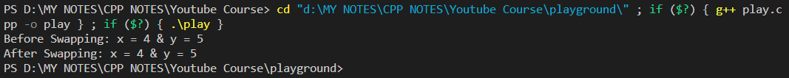
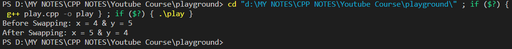

# Call by Value and Call by Reference in C++

There are two ways to pass value or data to a function in C++ language: Call by Value and Call by Reference. Original value is not modified in Call by Value but it IS modified in Call by Reference.


# Call by Value

```cpp
// Program to Swap the Value of 2 Variables

#include <iostream>
using namespace std;

// Call by Value
//*******************
// The below function will not swap x & y :: This function will not work because on calling this function swap(x,y) inside int main() function, what happens actually is that - the original values of (x = 4 and y=5) are just getting copied to the value of the arguments (int a, int b) and the actual swap is taking place just between the values of (int a, int b) while the values of (x = 4 and y=5) remains unaffected in the main program.
// This method of passing arguments to a function is called CALL BY VALUE.
//**********************************************************************************************
void swap (int a, int b) {    // temp   a  b
    int temp = a;             // 4      4  5
    a = b;                    // 4      5  5
    b = temp;                 // 4      5  4
}

int main() {
    int x = 4, y = 5;
    cout << "Before Swapping: x = "<< x <<" & y = "<< y << endl; 

    // Call by Value
    //******************
    // This function will not swap x & y
    swap(x, y);

    cout << "After Swapping: x = "<< x <<" & y = "<< y << endl; 
    return 0;
}
```

### Output:




# Call by Reference:

## Method 1: Using Pointers
---
```cpp
// Program to Swap the Value of 2 Variables

#include <iostream>
using namespace std;

// Call by Reference - Method 1 : Using Pointers
//************************************************
// This function will swap x & y :: This function will work because here, instead of copying the values of actual parameters (x = 4 and y=5) like the previous case, we are sending the ADDRESSES of variables (x = 4 and y=5) -  swapPointer(&x, &y) -  inside the swapPointer(int* a, int* b) function. And, inside the swapPointer() function, we are directly manipulating the values that are present at these addresses.
// This method of passing arguments to a function is called CALL BY REFERENCE.
//***********************************************************************************************
void swapPointer (int* a, int* b) {     // temp   a  b
    int temp = *a;                      // 4      4  5
    *a = *b;                            // 4      5  5
    *b = temp;                          // 4      5  4
}


int main() {
    int x = 4, y = 5;
    cout << "Before Swapping: x = "<< x <<" & y = "<< y << endl; 

    // This function will swap x & y
    swapPointer(&x, &y); 

    cout << "After Swapping: x = "<< x <<" & y = "<< y << endl; 

    return 0;
}
```

### Output:




## Method 2: Using Reference Variables
---
```cpp
// Program to Swap the Value of 2 Variables

#include <iostream>
using namespace std;

// Call by Reference - Method 2 : Using Reference Variables
//*********************************************************
// This function will also swap x & y :: Here, we are instructing our program specifically to not create a copy of the variables x = 4 & y = 5 [that are being fed to the function as       swapRefVar(x, y)] BUT MAKE CHANGES DIRECTLY TO THE ACTUAL VARIABLES x = 4 & y = 5 as they are fed to the function swapRefVar(x, y).
// This method of passing arguments to a function is called CALL BY REFERENCE.
//********************************************************************************************
void swapRefVar (int &a, int &b) {     // temp   a  b
    int temp = a;                      // 4      4  5
    a = b;                            // 4      5  5
    b = temp;                          // 4      5  4
}

int main() {
    int x = 4, y = 5;
    cout << "Before Swapping: x = "<< x <<" & y = "<< y << endl; 

    // This function will also swap x & y
    swapRefVar(x, y);

    cout << "After Swapping: x = "<< x <<" & y = "<< y << endl; 

    return 0;
}
```

### Output:

