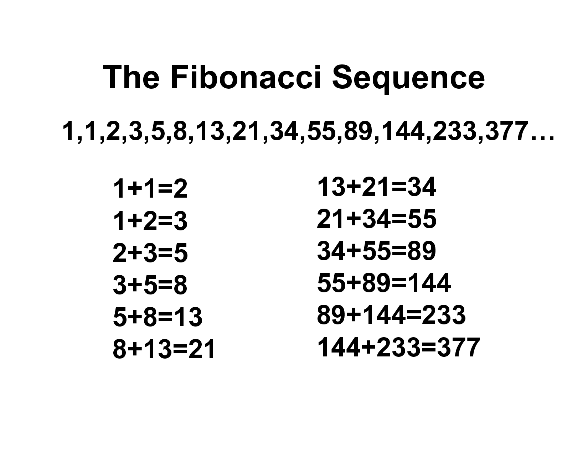

# Recursion & Recursive Functions

A function that calls itself is known as a ***recursive function***. And, this technique is known as **recursion**.

## Program to find the factorial of a number:

```cpp
#include <iostream>
using namespace std;

// Factorial of a number:
//***********************
// 6! = 6 * 5 * 4 * 3 * 2 * 1
// 0!  = 1
// 1! = 1
// 2! = 2 * 1
// n = n * (n-1)!

// An example of a Recursive Function.
// Calculating the factorial of a number:
int factorial(int n) {
    if (n <= 1) {
        return 1;
    }
    else {
        // Use of Recursion below.
        return n * factorial(n-1);
    }
}
// Dry Run
//----------
// Let n = 4;
// factorial(4) = 4 * factorial(3);
// factorial(4) = 4 * 3 * factorial (2);
// factorial(4) = 4 * 3 * 2 * factorial (1);
// factorial(4) = 4 * 3 * 2 * 1 = 24;

// Driver Code:
int main() {
    int n;
    cout << "Enter the value of n: " << endl;
    cin>>n;
    cout << "The value of factorial(n) is: " << factorial(n) << endl;
    return 0;
}
```

## Program to find the nth term in Fibonacci Series.



```cpp
#include <iostream>
using namespace std;

// Example of Recursive Function
// Function for finding the nth term of Fibonacci Series.
int fibonacci(int n) {
    if (n < 2) {
        return 1;
    }
    else {
        // Use of Recursion
        return fibonacci(n-1) + fibonacci (n-2);
    }
}

// Dry Run :
//----------
// let n = 4; // finding 3rd number of fibonacci series.
// fibonacci(4) = fibonacci(3) + fibonacci(2)  // step 1
// fibonacci(4) =  (fibonacci(2) + fibonacci(1)) + (fibonacci(1) + fibonacci(0))  // step 2
// fibonacci(4) = (fibonacci(1) + fibonacci(0)) + fibonacci(1) + fibonacci(1) + fibonacci(0)  //step 3
// fibonacci(4) = 1 + 1 + 1 + 1 + 1 = 5  // step 4

// In Actual Fibonacci Series : 1, 1, 2, 3, 5

// Driver Code:
int main() {
    int n;
    cout << "Enter the value of n: " << endl;
    cin>>n;
    cout << "The value of nth term in Fibonacci Sequence is: " << fibonacci(n) << endl;
    return 0;
}
```