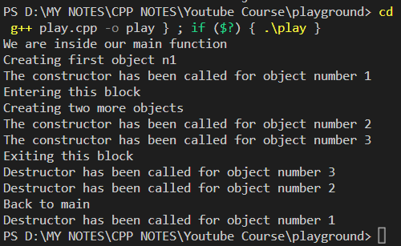

```cpp
#include <iostream>
using namespace std;

// Global Variable
// Its value will be same -- at one time -- for all the objects of the below class Number.
int count = 0;

class Number {
   int num;
   public:
      //Constructor
      Number(){
         count++;
         // When the value of the global variable 'count' increases - it increases for each & every object of the class - and its value remains same for each & every object of the class.
         cout << "The constructor has been called for object number "<<count<<endl;
      }

      // Destructor
      // A destructor (belonging to a class) is a special type of function which is called -- everytime -- by default -- by the compiler --  when an object of the class gets destroyed. 
      // Destructor never takes an argument nor does it return any value.
      // We can override the default destructor function of a class - on our own -  for doing something (additionally) that we want it to do when destroying an object --- see the code block below.
      // The name of the destructor function starts with a 'tilde' sign (~) followed by the name of the master class -- similar to constructor.
      ~Number(){
         //We can override the default destructor function of a class - on our own -  for doing something (additionally) that we want it to do when destroying an object
         cout << "Destructor has been called for object number "<<count<<endl;
         count--;
      }
};

// Driver Code:
int main()
{  
   cout<<"We are inside our main function"<<endl;
   cout<<"Creating first object n1"<<endl;
   Number n1;  // when the object “n1” is created the constructor 'Number()' will run.
   {
      cout<<"Entering this block"<<endl;
      cout<<"Creating two more objects"<<endl;
      Number n2, n3; // the constructor 'Number()' will run for both objects 
      cout<<"Exiting this block"<<endl;

      //On exiting this block, the destructor will run for both objects “n2” and “n3” -- whose scope ends beyond this block.
   }
   cout<<"Back to main"<<endl;
   return 0;

   // when the program ends the destructor will run for the object “n1” -- whose scope ends beyond this block.
}
```

### Code Output:


