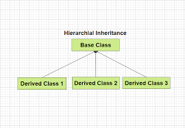
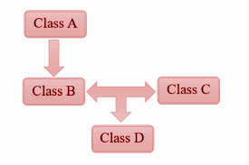

# Inheritance in C++ an Overview

- Reusability is a very important feature of OOPs
- In C++ we can reuse a class and add additional features to it
- Reusing classes saves time and money
- Reusing already tested and debugged classes will save a lot of effort of developing and debugging the same thing again

# What is Inheritance in C++?

- The concept of reusability in C++ is supported using inheritance
- We can reuse the properties of an existing class by inheriting it
- The existing class is called a Base class or a Parent class.
- The new class which is inherits from the base class is called a Derived class or Children class.
- Reusing classes saves time and money
- There are different types of inheritance in C++

# Forms of Inheritance in C++

- Single Inheritance
- Multiple Inheritance
- Hierarchical Inheritance
- Multilevel Inheritance
- Hybrid Inheritance

# Single Inheritance in C++

Single inheritance is a type of inheritance in which one derived class gets inherited from only one base class. 
For example, we have two classes “employee” and “programmer”. If the “programmer” class is inherited from the “employee” class which means that the “programmer” class can now implement the functionalities of the “employee” class.

# Multiple Inheritances in C++

 Multiple inheritance is a type of inheritance in which one derived class inherits from more than one base classes. For example, we have three classes namely- “employee”, “assistant” and “programmer”. If the “programmer” class is inherited from both the “employee” and “assistant” classes - this means that the “programmer” class can now implement the functionalities of both the “employee” and “assistant” classes.

 

# Hierarchical Inheritance

A hierarchical inheritance is a type of inheritance in which several derived classes are inherited from a single base class. For example, we have three classes “employee”, “manager” and “programmer”. If the “programmer” and “manager” classes are inherited from the “employee” class which means that the “programmer” and “manager” class can now implement the functionalities of the “employee” class.

# Multilevel Inheritance in C++

Multilevel inheritance is a type of inheritance in which one derived class is inherited from another derived class. For example, we have three classes “animal”, “mammal” and “cow”. If the “mammal” class is inherited from the “animal” class and “cow” class is inherited from “mammal” which means that the “mammal” class can now implement the functionalities of “animal” and “cow” class can now implement the functionalities of “mammal” class.

# Hybrid Inheritance in C++

Hybrid inheritance is a combination of various types of inheritances such as single,multiple, hierarchical and Multilevel inheritance. Therefore, hybrid inheritance is also known as multipath inheritance. For example, we have four classes “animal”, “mammal”, “bird”, and “bat”. If “mammal”  and “bird” classes are inherited from the “animal” class and “bat” class is inherited from “mammal” and “bird” classes which means that “mammal” and “bird” classes can now implement the functionalities of “animal” class and “bat” class can now implement the functionalities of “mammal” and “bird” classes.

