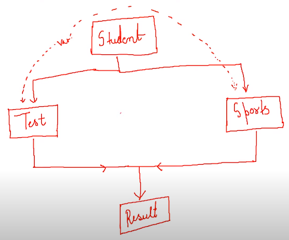

# Virtual Base Class:


Suppose we created a class “A” --- which contains a `public` member variable 'int a;' inside it.
Now, class A is being inherited by 2 other classes B & C (in public mode). So, they both recieve `public` member variable 'int a;' from class A.

Next, we create a class “D” which is being derived from class “B” and “C” as shown in figure (Multiple Inheritance).

As shown in figure,

1. Class “A” is the parent class of two classes “B” and “C”
1. And both “B” and “C” are the parent classes of class “D”

The main thing to note here is that the data member (`public` member variable 'int a;') of class “A” will be inherited twice in class “D” (one from class B and one from class C) because class “B” and “C” are the parent classes of class “D” and they both are being derived from class “A”.

So when the class “D” will try to access the data member `int a` of class “A” -- it will cause an ambiguity for the compiler and the compiler will throw an error. 
To solve this ambiguity we make class “A” as a ***Virtual Base Class***. To make a virtual base class “virtual” keyword is used.

**When one class is made virtual then only one copy of its data member and member functions is passed to the class which inherits from multiple of it's subclasses (as shown in the example case above).**

So in our example when we will make class “A” a virtual class then only one copy of its data members and member functions will be passed to the class D. This will help to solve the ambiguity.

The syntax of the virtual base class is shown in the code snippet below,

```cpp
#include <iostream> 
using namespace std; 

class A {    //We are making class A the vitual base class
public: 
    int a;
}; 

//So, while inheriting from A, we use the `virtual` keyword.
class B : public virtual A {  
    //inherits:
    //int a; 
}; 

// We can also write `virtual` keyword before the {{visibility-mode}}.
class C : virtual public A { 
    //inherits:
    //int a; 
};   

//Now, class D will get only one copy of `int a` data member.
class D : public B, public C { 
    //inherits:
    //int a;
}; 
```

## Virtual Base Class - A Deeper Dive:





```cpp
#include <iostream>
using namespace std;

class Student {   //This class is going to be our Virtual Base Class.
    protected:
        int roll_number;
    public:
        void set_roll_no(int a){
            roll_number = a;
        }
        void print_roll_no(void){
            cout << "Your roll no. is "<<roll_number<<endl;
        }
};

class TestMarks : virtual public Student {
    protected:
        float maths, physics;
    public:
        void set_marks(float m1, float m2){
            maths = m1;
            physics = m2;
        }
        void print_marks(void){
            cout<<"Your Marks are:"<<endl
                <<"Maths -- "<<maths<<endl
                <<"Physics --"<<physics<<endl;
        }
};

class SportsMarks : public virtual Student {
    protected:
        float score;
    public:
        void set_score(float sc){
            score = sc;
        }
        void print_score(void){
            cout<<"Your Sports score is "<<score<<endl;
        }
};

class Result : public TestMarks, public SportsMarks {
    private:
        int total;
    public:
        void display(void){
            total = maths + physics + score;
            print_roll_no();
            print_marks();
            print_score();
            cout<<"Your total score is "<<total<<endl;
        }
};

// Driver Code
int main()
{
    Result harry;
    harry.set_roll_no(36);
    harry.set_marks(71.0, 78);
    harry.set_score(8);
    harry.display();

    return 0;
}
```