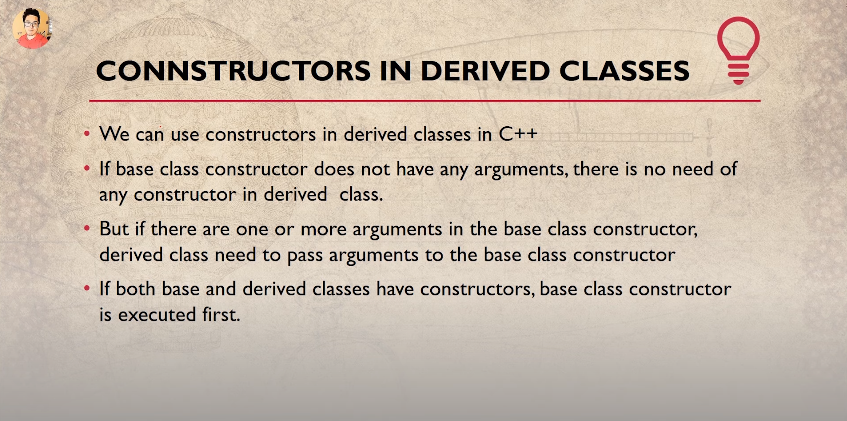
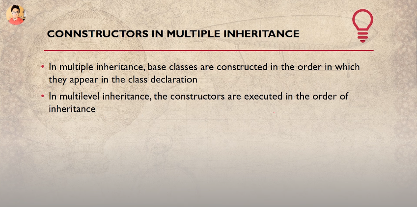
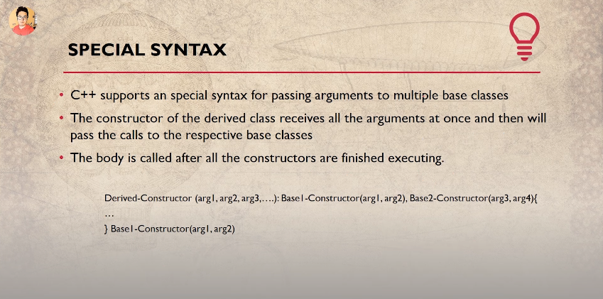
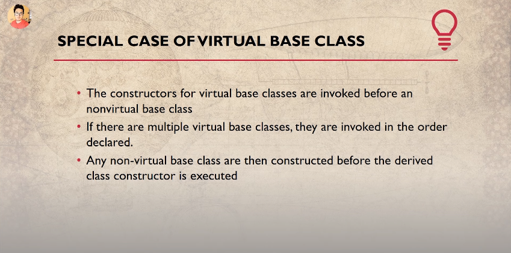
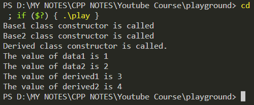

```cpp
#include <iostream>
using namespace std;

/*
Order of Execution of Constructor
---------------------------------
Case 1
*******
class B : public A {
    // constructor of A --> constructor of B
    // constructor of base class runs first.
}

Case 2:
*******
class A : public B, public C {
    // constructor of B --> constructor of C --> constructor of A
    // If there are more than 1 base classes (Multiple Inheritance), then the constructor of that base class which is mentioned/written first during inherited class declaration -- gets executed first. 
}

Case 3:
******
class A : public B, virtual public C, public D {
    // constructor of C --> constructor of B --> constructor of D --> constructor of A.
    // If there are more than 1 base classes (Multiple Inheritance), and one of them is a virtual base class, then the virtual base class constructor gets excecuted 1st, after that the constructor of non-vitual base classes gets executed in the order in which they are mentioned in inherited class declaration.
}

Case 4:
*******
class A : public B, virtual public C, virtual public D {
    // constructor of C --> constructor of D --> constructor of B --> constructor of A.
    // Constructors of vitual base classes are executed first.
    // Constructors of Virtual base classes are executed, in the order that they appear in the base list. 
}
*/

class Base1 {
    int data1;
    public:
        Base1(int a){
            data1 = a;
            cout << "Base1 class constructor is called"<<endl;
        }
        void printDataBase1(void){
            cout << "The value of data1 is "<< data1<<endl;
        }
};

class Base2 {
    int data2;
    public:
        Base2(int a){
            data2 = a;
            cout << "Base2 class constructor is called"<<endl;
        }
        void printDataBase2(void){
            cout << "The value of data2 is "<< data2<<endl;
        }
};

class Derived : public Base1, public Base2 {
    int derived1, derived2;
    public:
        Derived(int a, int b, int c, int d) : Base1(a), Base2(b) {
            derived1 = c;
            derived2 = d;
            cout << "Derived class constructor is called."<<endl;
        }
        void printDataDerived(void){
            cout << "The value of derived1 is "<< derived1<<endl;
            cout << "The value of derived2 is "<< derived2<<endl;
        }
};

// Driver Code
int main()
{
    Derived harry(1,2,3,4);
    harry.printDataBase1();
    harry.printDataBase2();
    harry.printDataDerived();
    return 0;
}
```

## Output:

